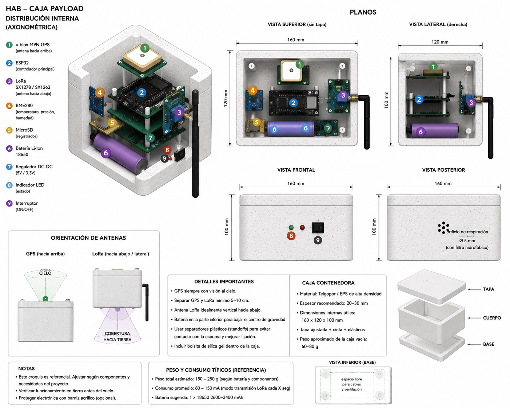

# HAB Balloon Project

Sistema de globo estratosférico (HAB - High Altitude Balloon) orientado a telemetría, investigación atmosférica y experimentación IoT/IIoT utilizando ESP32, LoRa, GNSS y comunicación híbrida.



---

# 🚀 Objetivos del proyecto

Este proyecto busca desarrollar una plataforma modular y reutilizable para:

- Telemetría de gran altitud
- Registro de variables atmosféricas
- Seguimiento GNSS en tiempo real
- Evaluación de enlaces LoRa de larga distancia
- Recuperación autónoma del payload
- Análisis posterior de datos científicos

---

# 📡 Variables registradas

## Posición y navegación
- Latitud
- Longitud
- Altitud GPS
- Velocidad horizontal
- Velocidad vertical
- Timestamp UTC

## Variables atmosféricas
- Temperatura
- Presión atmosférica
- Humedad relativa

## Dinámica del sistema
- Aceleración XYZ
- Giroscopio XYZ
- Vibraciones

## Telecomunicaciones
- RSSI LoRa
- SNR
- Pérdida de paquetes
- Tiempo entre transmisiones

## Energía
- Voltaje batería
- Consumo estimado

## Estado GNSS
- Cantidad de satélites
- HDOP
- Tipo de FIX

## Eventos
- Inicio de vuelo
- Burst del globo
- Descenso
- Aterrizaje

---

# 🧠 Arquitectura general

```text
                 ┌─────────────────┐
                 │   HAB Payload   │
                 │ ESP32 + LoRa    │
                 │ GPS + Sensores  │
                 └────────┬────────┘
                          │
                    LoRa 915 MHz
                          │
                          ▼
                ┌─────────────────┐
                │ Gateway Tierra  │
                │ Raspberry Pi    │
                │ ESP32 LoRa      │
                └────────┬────────┘
                         │
                        MQTT
                         │
          ┌──────────────┴──────────────┐
          ▼                             ▼
     Node-RED                       Grafana
```

---

# 🔧 Hardware principal

## Payload
- ESP32
- LoRa SX1278 / SX1262
- GPS u-blox M8N / M9N
- BME280 / BMP280
- MPU6050
- Módulo microSD
- Batería 18650 Li-Ion
- Regulador DC-DC
- Antena LoRa 915 MHz
- Antena GNSS activa
- Caja aislada EPS (telgopor)

## Gateway
- Raspberry Pi
o
- ESP32 LoRa

---

# 📦 Diseño del payload

Características del diseño:

- GPS orientado hacia el cielo
- LoRa separado físicamente del GNSS
- Batería ubicada abajo para bajar centro de gravedad
- Caja de EPS de alta densidad
- Sistema modular por separadores

## Recomendaciones importantes

- Separar GPS y LoRa mínimo 5–10 cm
- Mantener antena GNSS despejada
- Usar filtro hidrofóbico para respiración de la caja
- Agregar silica gel para condensación
- Evitar contacto directo PCB ↔ espuma

---

# 📂 Estructura del repositorio

```text
hab-balloon/
├── README.md
├── LICENSE
├── .gitignore
├── docs/
├── firmware/
├── hardware/
├── data/
├── analysis/
├── dashboards/
├── logs/
├── tests/
└── tools/
```

---

# 📊 Ejemplo de payload de datos

```json
{
  "time": "2026-05-01T15:42:10Z",
  "lat": -31.4201,
  "lon": -64.1888,
  "alt": 28540,
  "temp": -32.5,
  "pressure": 12.1,
  "accel": {
    "x": 0.01,
    "y": -0.02,
    "z": 1.02
  },
  "gyro": {
    "x": 0.2,
    "y": 0.1,
    "z": -0.3
  },
  "lora": {
    "rssi": -118,
    "snr": 7.5
  },
  "battery": 3.91
}
```

---

# 🛰️ Modos automáticos de misión

| Estado | Función |
|---|---|
| ASCENSO | Telemetría LoRa |
| BURST | Detección explosión |
| DESCENSO | Seguimiento continuo |
| ATERRIZAJE | Activación 4G |
| RECUPERACIÓN | Beacon LoRa |

---

# 📡 Estrategia híbrida LoRa + 4G

## En vuelo
- LoRa → telemetría continua
- GPS → seguimiento
- IMU → detección dinámica

## Al aterrizar
- EG91 → ubicación exacta vía MQTT
- LoRa → beacon de proximidad

---

# 🌎 Predicción de trayectoria

El proyecto contempla simulación de deriva atmosférica usando:

- altitud
- velocidad vertical
- viento por capas
- modelos meteorológicos

Fuentes posibles:
- NOAA
- OpenWeather

---

# 🔋 Consumo estimado

| Sistema | Consumo |
|---|---|
| ESP32 | 80–150 mA |
| LoRa TX | 120–250 mA |
| GPS | 20–40 mA |
| Sensores | <20 mA |

Autonomía típica:
- 1×18650 → 2–5 horas
- 2×18650 paralelo → 5–10 horas

---

# 🧪 Próximas mejoras

- Cámara onboard
- Sensor radiación
- Magnetómetro
- Predicción de caída en tiempo real
- APRS
- LTE fallback automático
- OTA updates
- Dashboard web

---

# 📈 Stack de software

## Firmware
- Arduino Framework
- PlatformIO

## Backend
- MQTT
- Node-RED
- Grafana

## Análisis
- Python
- Pandas
- Jupyter

---

# 🛠️ Compilación

## Requisitos

- PlatformIO
- Python 3.x

## Firmware ESP32

```bash
cd firmware/esp32_node
pio run
```

## Upload

```bash
pio run --target upload
```

---

# 📊 Análisis de datos

Ejemplo básico:

```python
import pandas as pd

df = pd.read_csv("data/raw/flight_001/data.csv")

print(df.head())
```

---

# ⚠️ Seguridad

- Verificar normativa aeronáutica local
- Usar paracaídas
- No lanzar cerca de aeropuertos
- Verificar condiciones meteorológicas
- Realizar pruebas en tierra antes del vuelo

---

# 📜 Licencia

MIT License.

---

# 👨‍💻 Autor

Proyecto desarrollado por David Tuzzi.

Orientado a:
- IIoT
- telemetría industrial
- comunicaciones LoRa
- automatización
- sistemas embebidos
- experimentación atmosférica


https://tuzziot.github.io/HAB-Balloon/
